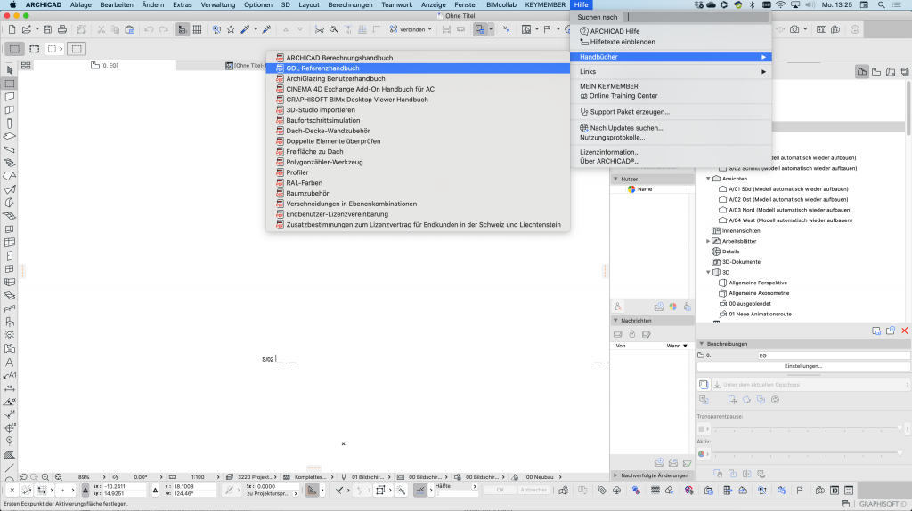

## GDL dans Archicad

Dans cet article, nous répondons aux questions fréquemment posées sur le Geometric Description Language (GDL) - le langage de script qu'ArchiCAD utilise pour créer des objets paramétriques. Nous vous expliquons ce qu'est GDL, pourquoi il est utile d'apprendre GDL, et comment faire vos premiers pas dans le monde GDL.

---

### Qu'est-ce que GDL ?
GDL (Geometric Description Language) est le langage de script utilisé par les bibliothèques ArchiCAD pour définir des objets paramétriques. Contrairement à un simple "Hello World", GDL produit des résultats pratiques en quelques lignes de code seulement. Des outils complexes comme les fenêtres ou les portes ne sont pas créés comme des éléments statiques, mais comme des objets dynamiques basés sur des scripts.  
Dans ArchiCAD, GDL est empaqueté dans des conteneurs LCF (avec le format de fichier GSM).

### Avantages de GDL
- **Prise en main rapide :** Même les scripts simples montrent des résultats visuels, ce qui est motivant.  
- **Comprendre le paramétrique :** Avec GDL, vous acquérez une compréhension fondamentale de la modélisation paramétrique dans les logiciels CAO.  
- **Applications pratiques :** Vous pouvez optimiser les flux de travail quotidiens, car de nombreux objets et outils dans ArchiCAD sont basés sur GDL.  
- **Script visuel :** Des outils plus récents comme [Param-O](https://graphisoft.com/downloads/param-o) permettent une approche visuelle, facilitant ainsi la prise en main.

---

## Premiers pas avec GDL

Un bon point de départ est de se concentrer sur un script 2D et 3D simple. Dans la version suisse d'ArchiCAD, vous trouverez l'éditeur GDL sous _Fichier → Objets GDL → Créer des objets GDL_.   

  - **Conseil :** Au début, limitez-vous aux commandes de base, comme la création d'un cube avec la commande `block`.  
  - **Visualisation :** Utilisez les vues 2D et 3D pour vérifier immédiatement les effets de votre script.

---

## Ressources utiles

- Le [Manuel de référence GDL](https://help.graphisoft.com/AC/24/FRA/GDL.pdf) offre un aperçu complet des commandes.

- Des sites comme [SelfGDL.de](https://www.selfgdl.de/) et le [Livre de recettes GDL](https://issuu.com/dnicholsoncole/docs/gdlcookbook3_01) de David Nicholson-Cole fournissent des exemples pratiques.

**Ressources supplémentaires :**   
Voici une compilation de plateformes utiles où vous pouvez trouver des éléments GDL prêts à l'emploi et des informations complémentaires :   

- [idc.ch](https://www.idc.ch/archicad/ueber-archicad/zusatzprodukte/zusatzbibliotheken/)   
- [bimobject.com](https://www.bimobject.com/de-ch/product?sort=trending)    
- [bimcomponents.com](https://bimcomponents.com/)   
- [cadswift.com.au](https://cadswift.com.au/)   
- [arroway-textures.ch](https://www.arroway-textures.ch/)   
- [mtextur.com](https://www.mtextur.com/)   
- [bimbakery.co](http://bimbakery.co/)    
- [turbosquid.com](https://www.turbosquid.com/)   
- [b-prisma.de](https://www.b-prisma.de/)   
- [concepsysbim.com](http://www.concepsysbim.com/)    
- [prodlib.com](https://www.prodlib.com/?lang=en)   
- [3dwarehouse.sketchup.com](https://3dwarehouse.sketchup.com/)   
- [archive3d.net](https://archive3d.net/)   
- [velux.at](https://www.velux.at/fachkunden/tools-technik/3d-bim-objekte)    
- [eptar.hu](https://www.eptar.hu/)   
- [poliigon.com](http://www.poliigon.com/)    

De plus, les échanges sur les forums (comme [ArchiCAD-Talk](https://archicad-talk.graphisoft.com/)) sont utiles pour bénéficier de l'expérience d'autres utilisateurs.

---

**Publié le :** {{ page.meta.date }} | **Code :** {{ page.file.name[:10] }} | **Auteur :** {{ page.meta.author }}

**Mots-clés :** {{ page.meta.tags | join(', ') }} | **Original:** {{ page.meta.original }}