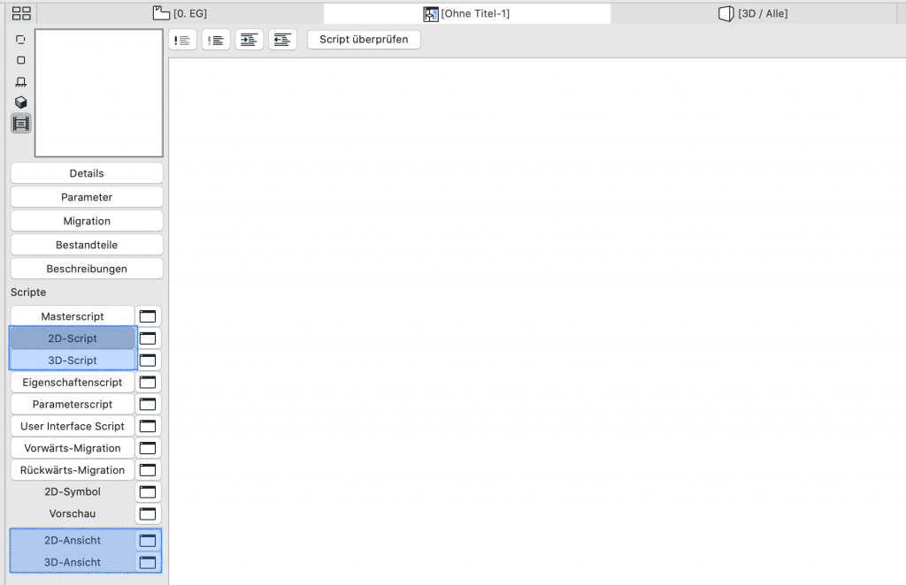

## GDL in Archicad

In questo articolo rispondiamo alle domande frequenti sul Geometric Description Language (GDL) – il linguaggio di scripting che ArchiCAD utilizza per creare oggetti parametrici. Spieghiamo cos'è GDL, perché vale la pena impararlo e come muovere i primi passi nel mondo GDL.

---

### Cos'è GDL?
GDL (Geometric Description Language) è il linguaggio di scripting che le librerie di ArchiCAD utilizzano per definire oggetti parametrici. A differenza di un semplice "Hello World", GDL fornisce risultati pratici dopo poche righe di codice. Strumenti complessi come finestre o porte non vengono creati come elementi statici, ma come oggetti dinamici basati su script.  
In ArchiCAD, GDL viene impacchettato nei cosiddetti contenitori LCF (con il formato di file GSM).

### Vantaggi di GDL
- **Avvio rapido:** Anche script semplici mostrano risultati visivi, il che è motivante.  
- **Comprendere la parametrica:** Con GDL, acquisisci una comprensione fondamentale della modellazione parametrica nei software CAD.  
- **Applicazioni pratiche:** Puoi ottimizzare i flussi di lavoro quotidiani poiché molti oggetti e strumenti in ArchiCAD si basano su GDL.  
- **Scripting visuale:** Strumenti più recenti come [Param-O](https://graphisoft.com/downloads/param-o) consentono un approccio visivo, facilitando l'inizio.

---

## Primi passi con GDL

Un buon punto di partenza è concentrarsi su uno script 2D e 3D semplice. Nella versione svizzera di ArchiCAD, troverai l'editor GDL in _File → Oggetti GDL → Crea oggetti GDL_.   

  - **Suggerimento:** Inizialmente, limitati ai comandi di base, come la creazione di un cuboide con il comando `block`.  
  - **Visualizzazione:** Utilizza le viste 2D e 3D per verificare immediatamente gli effetti del tuo script.

---

## Risorse utili

- Il [Manuale di riferimento GDL](https://help.graphisoft.com/AC/24/ITA/GDL.pdf) offre una panoramica completa dei comandi.

- Siti come [SelfGDL.de](https://www.selfgdl.de/) e il [Ricettario GDL](https://issuu.com/dnicholsoncole/docs/gdlcookbook3_01) di David Nicholson-Cole forniscono esempi pratici.

**Risorse aggiuntive:**   
Ecco una raccolta di piattaforme utili dove puoi trovare elementi GDL già pronti e ulteriori informazioni:   

- [idc.ch](https://www.idc.ch/archicad/ueber-archicad/zusatzprodukte/zusatzbibliotheken/)   
- [bimobject.com](https://www.bimobject.com/de-ch/product?sort=trending)    
- [bimcomponents.com](https://bimcomponents.com/)   
- [cadswift.com.au](https://cadswift.com.au/)   
- [arroway-textures.ch](https://www.arroway-textures.ch/)   
- [mtextur.com](https://www.mtextur.com/)   
- [bimbakery.co](http://bimbakery.co/)    
- [turbosquid.com](https://www.turbosquid.com/)   
- [b-prisma.de](https://www.b-prisma.de/)   
- [concepsysbim.com](http://www.concepsysbim.com/)    
- [prodlib.com](https://www.prodlib.com/?lang=en)   
- [3dwarehouse.sketchup.com](https://3dwarehouse.sketchup.com/)   
- [archive3d.net](https://archive3d.net/)   
- [velux.at](https://www.velux.at/fachkunden/tools-technik/3d-bim-objekte)    
- [eptar.hu](https://www.eptar.hu/)   
- [poliigon.com](http://www.poliigon.com/)    

Inoltre, lo scambio di idee nei forum (come [ArchiCAD-Talk](https://archicad-talk.graphisoft.com/)) è utile per beneficiare delle esperienze di altri utenti.

---

**Pubblicato il:** {{ page.meta.date }} | **Codice:** {{ page.file.name[:10] }}  | **Autore:** {{ page.meta.author }}

**Tag:** {{ page.meta.tags | join(', ') }} | **Originale:** {{ page.meta.original }}
