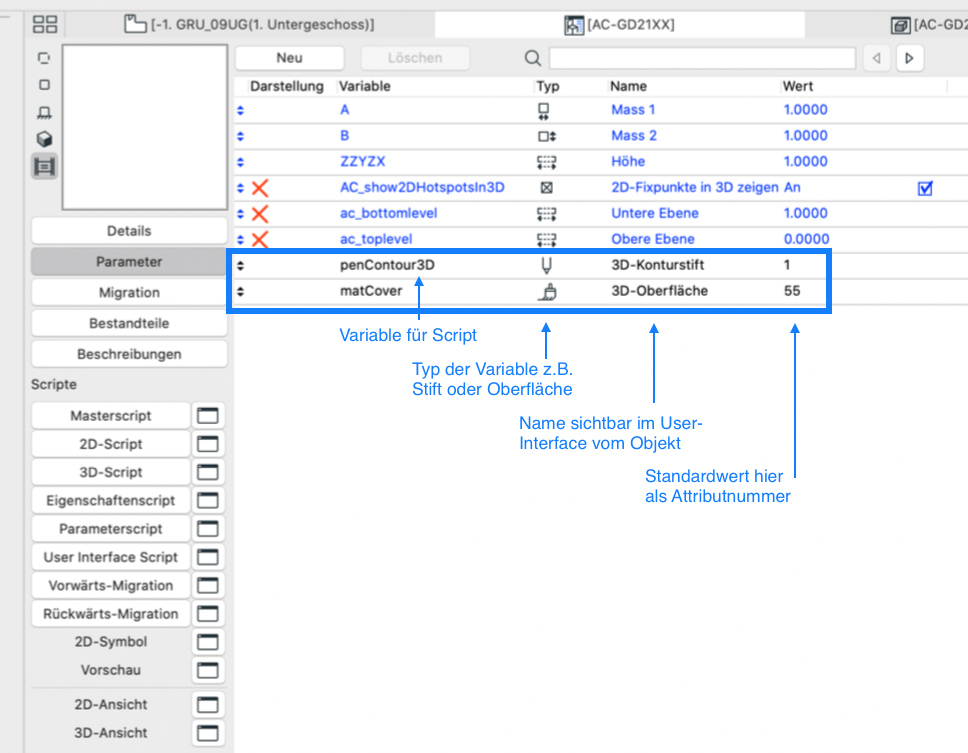
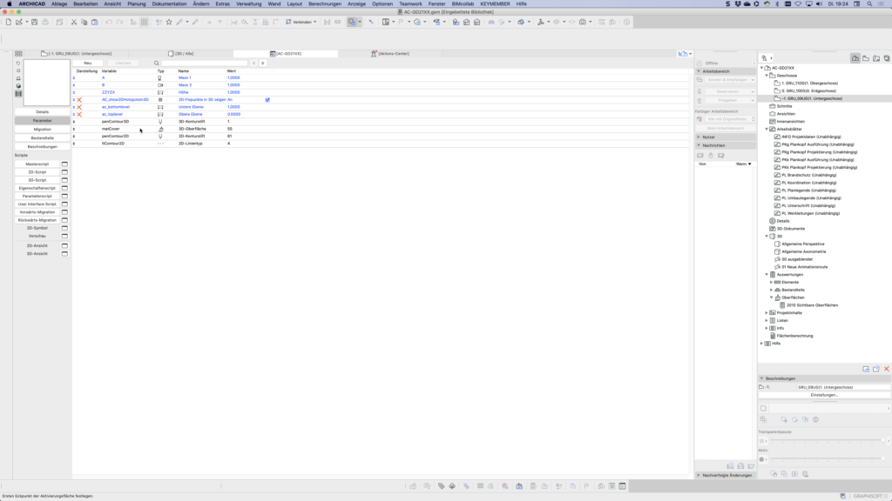

## Conseils généraux

Avant de commencer votre premier script, voici quelques conseils utiles :

1. **Esquissez vos idées** : Notez brièvement vos idées pour identifier les paramètres importants.
2. **Définissez les exigences** : Divisez les exigences en fonctions de base et en fonctions "agréables à avoir".
3. **Prototypage** : Expérimentez différentes approches pour trouver des solutions. Le prototypage peut vous aider à tester et à affiner vos idées.

4. **Structure du script** : Commentez votre script et utilisez des titres pour améliorer la lisibilité. Un code clairement structuré facilite la collaboration en équipe.

```
!Commencez votre script avec quelques informations
    !Titre de l'objet
    !Date
    !Votre nom
    !Nom du script, par ex. Script 3D

Structurez
    votre
        travail
    avec des
tabulations.

"M A J U S C U L E & minuscule" sert uniquement à une meilleure vue d'ensemble
    >>Graphisoft écrit presque tout en minuscules
    >>Le livre de recettes GDL recommande les commandes   "MAJUSCULES"
                                            attributs "minuscules"

END !--------------- Terminez votre script par END.
```
---
## Structure du script

- Commentez le script avec `!` et ajoutez des titres.
- Utilisez des tabulations pour une structure claire.
- Utilisez des lettres majuscules pour les commandes et des minuscules pour les attributs.
- Utilisez des sous-routines pour organiser des scripts complexes.
- Terminez chaque script avec la commande `END`.
- Créez un nouveau GDL et vérifiez le résultat dans la vue 3D.
- Plus d'informations peuvent être trouvées dans le [Guide de style GDL de Graphisoft](http://gdl.graphisoft.com/gdl-style-guide).

---
## Création de GDL
### Script 3D
**1. Créer un nouveau GDL :**

- Ouvrez ArchiCAD et allez dans le menu "Fichier".
- Sélectionnez "Nouveau" puis "Objet GDL" pour créer un nouveau script GDL.

**2. Insérer le script de bloc :**

- Ouvrez l'éditeur de script 3D dans votre nouvel objet GDL.
- Copiez et collez le script de bloc suivant dans l'éditeur.

**3. Vérifiez le résultat :**

- Ouvrez la vue 3D sur le côté gauche.


<div class="responsive-container">
  <div>
    <pre><code>
!Bloc à bloc
!20210903
!Manuel Emmenegger
!Script 3D

block 1,2,3

end !Fin du script
    </code></pre>
  </div>
  <div>
      
  </div>
</div>

**4. Vérifiez le résultat :**

- Après la commande, les entrées _1,2,3_ représentent _x,y,z_. Jouez avec ces valeurs et vérifiez le résultat dans la vue 3D. Plus d'informations sur cette commande peuvent être trouvées sur [selfgdl.de](https://www.selfgdl.de/3d-elemente/grundkoerper/block/).

---

### Script 2D
À l'étape suivante, nous révisons la représentation 2D. Ouvrez le script 2D et ajoutez les lignes appropriées pour générer une projection automatique à partir du script 3D. Utilisez cette commande uniquement pour la vérification, car elle peut ralentir la construction du plan d'étage avec une géométrie complexe. Plus d'informations peuvent être trouvées sur [selfgdl.de](https://www.selfgdl.de/2d-elemente-2/projektionen/project2/).


<div class="responsive-container">
  <div>
    <pre><code>
!Bloc à bloc
!20210903
!Manuel Emmenegger
!Script 2D

project2 3,270,1

end !Fin du script
    </code></pre>
  </div>
  <div>
        
  </div>
</div>

---

### Sauvegarde
Enregistrez votre premier GDL dans la bibliothèque intégrée via "Fichier/enregistrer" et enregistrez le fichier ArchiCAD en tant que .pln pour intégrer le GDL.

---

## Paramètres 3D
### Géométrie
Il est maintenant temps de paramétrer cet élément. Nous commencerons par quelques paramètres standard. Ouvrez l'onglet "Paramètres" sur le côté gauche dans notre élément déjà créé. Il devrait y avoir trois paramètres standard ici : Paramètre A pour l'axe X, Paramètre B pour l'axe Y et Paramètre ZZYZX pour l'axe Z.

Remplacez les nombres dans le script par les paramètres standard A, B et ZZYZX et vérifiez les changements dans la vue 3D. Ces paramètres affectent également la vue 2D grâce à la commande "project2".

Enregistrez l'élément, fermez l'éditeur GDL et placez l'élément avec l'outil objet.

```
!Bloc à bloc
!20210903
!Manuel Emmenegger
!Script 3D

block A,B,ZZYZX

end !Fin du script
```

Appuyez sur "T" pour ouvrir les paramètres de l'objet, où vous trouverez les paramètres A, B et ZZYZX. Votre objet GDL paramétré est maintenant créé.
[](assets/ac210-1010_03_Settings-Dialog.png)

---

### Représentation
Pour explorer davantage de paramètres, sélectionnez l'objet GDL et appuyez sur Ctrl+Shift+O.

Créez deux nouveaux paramètres dans l'onglet "Paramètres". Pour la dénomination, un concept cohérent est recommandé, éventuellement basé sur le [Standard Graphisoft](https://gdl.graphisoft.com/gdl-style-guide/naming-conventions). Des noms plus longs sont utiles pour reconnaître directement les paramètres sans avoir besoin d'une légende.

[](assets/ac210-1010_04_Parameter.png)

Le tableau de paramètres contient les colonnes importantes suivantes :

- Affichage : Contrôle l'affichage dans l'interface (par exemple, gras, masqué)
- Variable : Nom de la variable pour le script
- Type : Type de variable (par exemple, plume, surface)
- Nom : Nom affiché pour l'utilisateur
- Valeur : Valeur par défaut du paramètre

Plus de détails sur les types de paramètres peuvent être trouvés dans la [documentation](https://help.graphisoft.com/AC/25/ger/_AC25_Help/140_UserInterfaceDialogBoxes/140_UserInterfaceDialogBoxes-66.htm#XREF_66121_GDL_Master_Window).

Ajoutons maintenant les commandes "pen" pour la plume de contour et "set material" pour la surface dans le script. Puis enregistrez l'élément et vérifiez le résultat.

```
!Bloc à bloc
!20210903
!Manuel Emmenegger
!Script 3D

pen            penContour3D
set material   matCover

block A,B,ZZYZX

end !Fin du script
```
---
## Script 2D personnalisé
### Paramètres 2D
Maintenant, nous voulons examiner de plus près la représentation bidimensionnelle de notre bloc. Pour cela, nous allons travailler avec les commandes [line2](https://www.selfgdl.de/2d-elemente-2/zeichnungselemente/line2/) et [rect2](https://www.selfgdl.de/2d-elemente-2/zeichnungselemente/rect2/) ainsi qu'avec les attributs [pen](https://www.selfgdl.de/attribute/allgemein/pen/) et [set line\_type](https://www.selfgdl.de/attribute/linien/set-line_type/).

Un script 2D séparé offre deux avantages importants :

1. Pour les éléments 3D complexes, la représentation du plan d'étage est plus rapide car tout ne doit pas être projeté.

2. Les plans d'étage utilisent souvent des symboles au lieu de projections pures, par exemple pour les prises et les interrupteurs.

Pour distinguer les lignes project2 des nôtres, nous créons d'abord de nouveaux paramètres comme indiqué dans la capture d'écran.
[](assets/ac210-1010_05_Parameter.png)


Les commandes "pen" et "line_type" sont insérées après project2, de sorte que les lignes project2 sont dessinées avec la plume 1 et le type de ligne 1, et toutes les autres lignes reçoivent les nouveaux attributs.

---

### line2
Avec la commande line2, nous dessinons les quatre lignes de notre bloc vues d'en haut. La commande utilise deux paires de coordonnées (x1,y1,x2,y2) et trace une ligne entre ces points. Les quatre lignes forment un rectangle qui devrait être congruent à la représentation project2 dans la vue 2D.

```
!Bloc à bloc
!20210903
!Manuel Emmenegger
!Script 2D

project2 3,270,1

pen            penContour2D
set line_type  ltContour2D
   !line2 x1,y1,x2,y2
    line2 0,0,A,0
    line2 A,0,A,B
    line2 A,B,B,0
    line2 0,B,0,0

end !Fin du script
```
---

### rect2
La commande [rect2](https://www.selfgdl.de/2d-elemente-2/zeichnungselemente/rect2/) permet de remplacer les quatre lignes par une seule définition de rectangle. Un rectangle est dessiné entre deux points (x1,y1) et (x2,y2).

```
!rect2 x1,y1,x2,y2
 rect2 0,0,A,B
```

Comme vous l'avez probablement remarqué, les deux commandes "line2" et "rect2" ne fonctionnent pas de la même manière que la commande "block". Avec la commande "block", nous ne pouvions pas déterminer le point de départ du bloc, c'est-à-dire l'origine de l'objet (point de départ dans l'espace), car nous commencions toujours automatiquement au point 0,0,0. Avec la commande "[add](https://www.selfgdl.de/1_ko_trafos/3d_komplex/add/)", cette limitation peut être contournée plus tard. Les commandes 2D offrent ainsi plus de flexibilité dans le positionnement des éléments.

---

### poly2
Après avoir appris les outils de ligne, nous voulons maintenant créer des hachures avec la commande "[poly2](https://www.selfgdl.de/2d-elemente-2/polygone/poly2/)". Pour cela, nous avons également besoin de la commande "[set fill](https://www.selfgdl.de/attribute/schraffuren/set-fill/)" pour contrôler le type de hachure.

Créez les paramètres comme indiqué dans la capture d'écran et ajoutez le type de hachure dans le script après les définitions de plume et de type de ligne.

[](assets/ac210-1010_06_Parameter.png)


Remplacez la commande rect2 par poly2 et ajoutez le nombre de coins (4) et le type d'affichage (1+2+4+0) avant les valeurs xy. Les points correspondent aux mêmes points d'extrémité qu'avec line2.

La commande "poly2" diffère de "rect2" par :

- Nombre variable de coins
- Affichage de hachure ou de contour
- Possibilité de polygones ouverts

```
!Bloc à bloc
!20210903
!Manuel Emmenegger
!Script 2D

project2 3,270,1

pen            penContour2D
set line_type  ltContour2D
set fill       fillType2D
   !poly2 n,ContoursEtRemplissage,
   !      x1,y1,
   !      ..
   !      Xn,yn
    poly2 4,1+2+4+0,
          0,0,
          A,0,
          A,B,
          0,B

end !Fin du script
```
---

### poly2_
La commande poly2_ offre des options de contrôle étendues pour les bords et les plumes. Nous commençons avec [poly2_](https://www.selfgdl.de/2d-elemente-2/polygone/poly2_/), où chaque valeur xy reçoit un statut : 1 pour les lignes visibles, -1 pour le point final du polygone. Des détails sur le statut peuvent être trouvés sur [selfgdl.de](https://www.selfgdl.de/2d-elemente-2/polygone/poly2_/).

```
!poly2_ n,ContoursEtRemplissage,
!       x1,y1,Statut,
!       ..
!       x2,y2,Statut
 poly2_ 4,1+2+4+0,
        0,0,1,
        A,0,1,
        A,B,1,
        0,B,1
```
---

### poly2_A
Avec [poly2_A](https://www.selfgdl.de/2d-elemente-2/polygone/poly2_a/), nous contrôlons la plume de premier plan de la hachure - idéal pour les hachures solides.

```
!poly2_A n,ContoursEtRemplissage,PlumeRemplissage,
!        x1,y1,Statut,
!        ..
!        x2,y2,Statut
 poly2_A 4,1+2+4+0,penFront2D,
         0,0,1,
         A,0,1,
         A,B,1,
         0,B,1
```
---

### poly2_B
La commande [poly2_B](https://www.selfgdl.de/2d-elemente-2/polygone/poly2_b/) offre les options de contrôle les plus étendues, car les plumes de premier plan et d'arrière-plan peuvent être définies. Après avoir enregistré et placé l'élément dans le plan d'étage, tous les paramètres créés peuvent être testés.

```
!poly2_B n,ContoursEtRemplissage,PlumeRemplissage,
!        PlumeArrièrePlan,
!        x1,y1,Statut,
!        ..
!        x2,y2,Statut
 poly2_B 4,1+2+4+0,penFront2D,
         penBack2D,
         0,0,1,
         A,0,1,
         A,B,1,
         0,B,1
```

---

**Publié le:** {{ page.meta.date }} | **Code:** {{ page.file.name[:10] }}  | **Auteur:** {{ page.meta.author }}

**Tags:** {{ page.meta.tags | join(', ') }} | **Original:** {{ page.meta.original }}