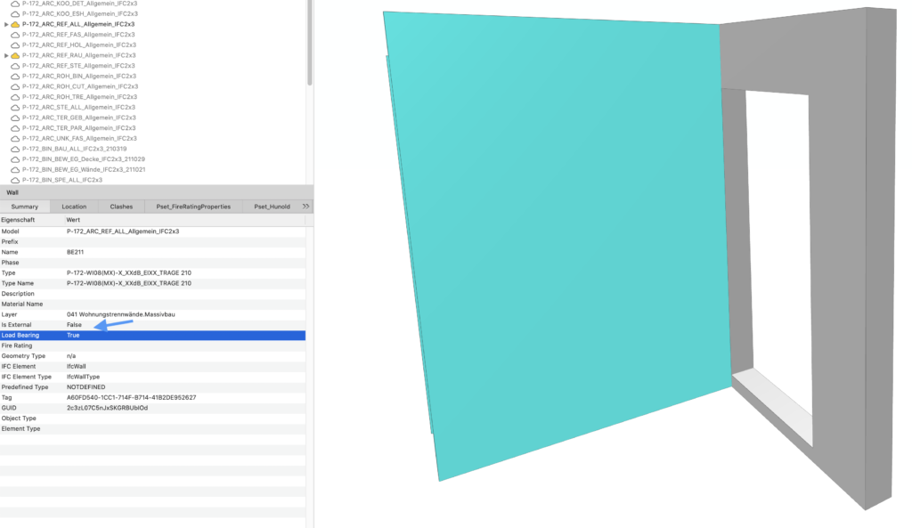
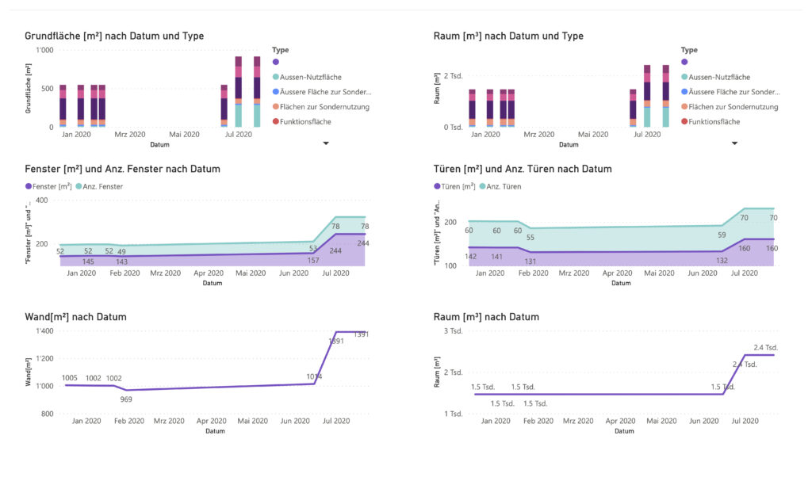

## Export
Choosing the right tool in ArchiCAD is crucial for a successful IFC export. While standard tools like walls, slabs, and roofs work with clearly defined parameters for length, width, and height, the morph tool behaves more like digital clay without fixed parameters. Below, I demonstrate how different tool settings affect the export using five test boxes. Even though the examples are ArchiCAD-specific, they illustrate a fundamental principle: The choice of modeling tool directly influences export quality.

### Archicad Error Message
Error messages during export should not simply be clicked away but examined carefully. Even when they provide little information, they give important clues about possible problems. In this case, five elements are missing from the export - the reason is elements with 0mm thickness.

### Archicad Export Log
The export log provides a detailed insight into the export process. In addition to calculation times for individual process steps, it also shows potential problems such as corrupt geometries or duplicate GUIDs - and this even without performing an IFC export.

In our last export, problems were identified with 5 out of 21 elements. These are listed in the lower part of the log with their unique GUIDs. With this information, we can now specifically search for the affected elements and fix the causes.

Manually searching for problematic elements is time-consuming, which is why clean modeling from the start is important. With the "Find & Select" tool in ArchiCAD, the affected elements can be quickly found by their GUID. Similar search functions are available in most IFC viewers.

Neither the General IFC Translator 2x3 nor the IFC Schema 4 in ArchiCAD 25 can export the marked elements. The solution lies in the translator settings: With "Exact Geometry Export" activated, the export works without error messages. But be careful - this setting has other effects as well.

## Visual Inspection
### Archicad Geometry Check
Visual inspection is essential, especially for partial models and structural exports. The following elements are particularly prone to errors and should be carefully checked:

- Openings (windows, doors)
- Solid commands (slopes)
- Intersections (wall corners, story transitions)
- Renovation filter
- Layer offsets

Clean 3D modeling is more important than 2D representation. Critical elements should be checked at the beginning of a project, after which spot checks are sufficient. Early checks make it possible to optimize the team's workflow through favorites, templates, and training.

### Stories
For stories, I always check their designation. These should:
- Have the same number of digits (e.g., 08UG, 30OG instead of 8UG, 10OG)
- Be numbered consecutively
- Always have the number at the front
- Not use negative numbers for basements (avoid -2UG)
- 

This is important for correct sorting. Here are some examples:

  

    <h4>Variant 1</h4>
    <table>
      <thead>
        <tr>
          <th>Unsorted</th>
          <th>Sorted</th>
        </tr>
      </thead>
      <tbody>
        <tr><td>AT04</td><td>AT04</td></tr>
        <tr><td>OG03</td><td>EG00</td></tr>
        <tr><td>OG02</td><td>OG01</td></tr>
        <tr><td>OG01</td><td>OG02</td></tr>
        <tr><td>EG00</td><td>OG03</td></tr>
        <tr><td>UG01</td><td>UG01</td></tr>
        <tr><td>UG02</td><td>UG02</td></tr>
      </tbody>
    </table>
  

  

    <h4>Variant 2</h4>
    <table>
      <thead>
        <tr>
          <th>Unsorted</th>
          <th>Sorted</th>
        </tr>
      </thead>
      <tbody>
        <tr><td>04AT</td><td>00EG</td></tr>
        <tr><td>03OG</td><td>01OG</td></tr>
        <tr><td>02OG</td><td>01UG</td></tr>
        <tr><td>01OG</td><td>02OG</td></tr>
        <tr><td>00EG</td><td>02UG</td></tr>
        <tr><td>01UG</td><td>03OG</td></tr>
        <tr><td>02UG</td><td>04AT</td></tr>
      </tbody>
    </table>
  

  

    <h4>Variant 3 (Recommended)</h4>
    <table>
      <thead>
        <tr>
          <th>Unsorted</th>
          <th>Sorted</th>
        </tr>
      </thead>
      <tbody>
        <tr><td>14AT</td><td>14AT</td></tr>
        <tr><td>13OG</td><td>13OG</td></tr>
        <tr><td>12OG</td><td>12OG</td></tr>
        <tr><td>11OG</td><td>11OG</td></tr>
        <tr><td>10EG</td><td>10EG</td></tr>
        <tr><td>09UG</td><td>09UG</td></tr>
        <tr><td>08UG</td><td>08UG</td></tr>
      </tbody>
    </table>
  

Recommendation: Start numbering from the ground floor (e.g., 10EG). This allows:

- Flexible expansion upward and downward
- Logical numbering (GF=10, 1st floor=11, 1st basement=09)
- Consistent sorting in all programs

### IFC Entities
The control of IFC entities should be done systematically:

1. Random checking of Property Sets (Psets):
    - Are all required Psets present?
    - Do the Psets contain the correct information?
    - Was information like "load bearing" correctly transferred to the standard field?

2. Checking in different IFC viewers:
    - IFC files can be interpreted differently in different viewers
    - Problems can occur especially with non-standard IFC entities
    - The source of the error is not always in the export itself

3. Standard properties:
    - Important properties such as "load bearing/non-load bearing" must be on the defined standard fields
    - Only then will automated checking routines work reliably

### Efficient Testing Methods

   BIMCollab Zoom:

   - SmartViews allow filtering and coloring of model contents
   - Comparable to graphic overrides in ArchiCAD
   - Example: Automatic coloring of windows by type number
   - Enables quick visual control of types and their assignment

   Solibri:

   - Offers extensive evaluation options
   - Example: Grouping and coloring facade panels by size
   - Improves understanding of model information through visual representation
   - Supports model optimization

## Data-Based Testing
### Excel
Excel offers efficient ways to check conventions and duplicates without requiring special testing software:

- Under "Data" > "Data Validation," simple validation rules can be created
- Tables can be exported from BIMCollab Zoom as CSV and analyzed in Excel
- After adjustments, the Excel file can be imported back into ArchiCAD

Examples of checks:

- Column 1: Validation of naming conventions
- Column 2: Bar chart to visualize frame widths
- Column 3: Color-coded categorization of frame heights

### PowerBI
PowerBI offers extensive possibilities for data analysis and visualization. With interactive dashboards, data dependencies can be clearly displayed, providing a new perspective on model information. Many tools have direct PowerBI interfaces. Alternatively, CSV exports can be used, which automatically update the dashboard when consistently saved under the same path.

A practical example: By merging about 50 IFC files from different project stages in one model and exporting them as a CSV component list, changes such as volume changes between project stages can be efficiently compared and analyzed. This enables transparent documentation of project development and quantifiable statements about changes in different project phases.

---
**Published on:** {{ page.meta.date }} | **Code:** {{ page.file.name[:10] }}  | **Author:** {{ page.meta.author }}

**Tags:** {{ page.meta.tags | join(', ') }} 