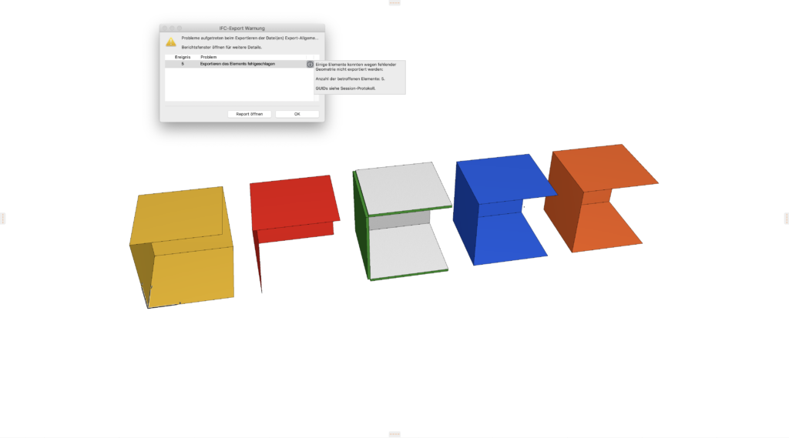
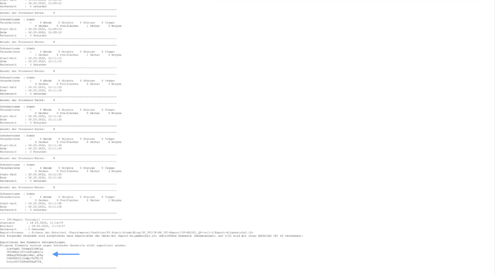
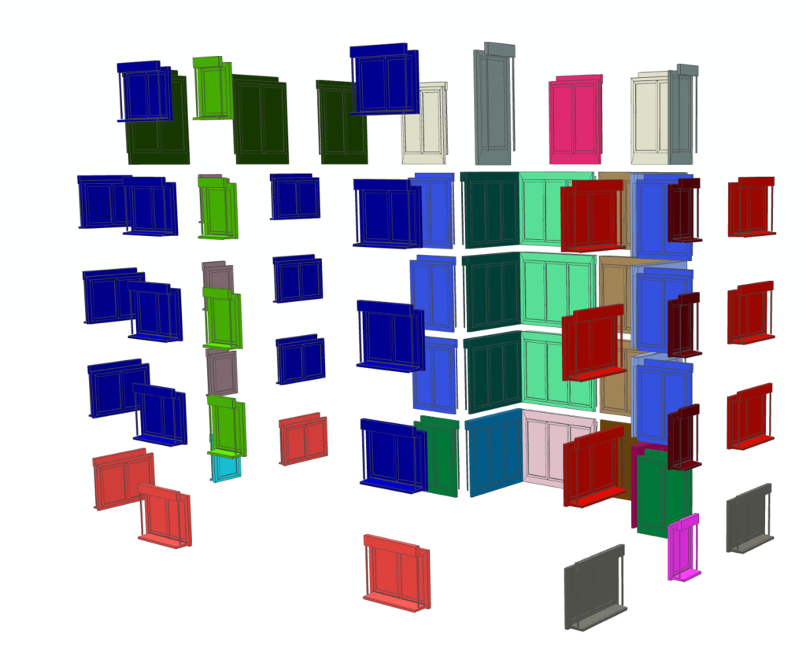
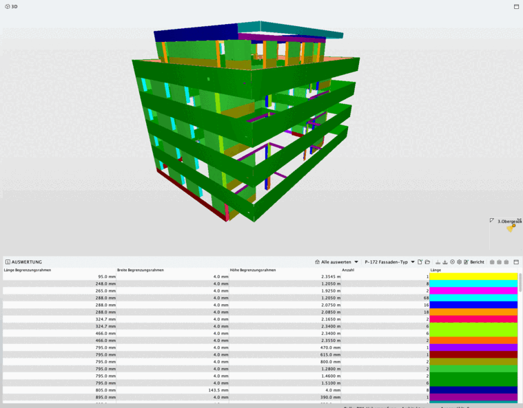

## Export
Le choix du bon outil dans ArchiCAD est crucial pour un export IFC réussi. Alors que les outils standard comme les murs, les dalles et les toits fonctionnent avec des paramètres clairement définis pour la longueur, la largeur et la hauteur, l'outil morphe se comporte davantage comme de l'argile numérique sans paramètres fixes. Ci-dessous, je démontre comment différents paramètres d'outils affectent l'export en utilisant cinq boîtes de test. Même si les exemples sont spécifiques à ArchiCAD, ils illustrent un principe fondamental : Le choix de l'outil de modélisation influence directement la qualité de l'export.

### Message d'erreur Archicad
Les messages d'erreur lors de l'export ne doivent pas simplement être fermés, mais examinés attentivement. Même lorsqu'ils fournissent peu d'informations, ils donnent des indices importants sur les problèmes possibles. Dans ce cas, cinq éléments sont manquants à l'export - la raison en est des éléments d'épaisseur 0 mm.

### Journal d'export Archicad
Le journal d'export fournit un aperçu détaillé du processus d'export. En plus des temps de calcul pour chaque étape, il montre également les problèmes potentiels tels que les géométries corrompues ou les GUID dupliqués - et ce, même sans effectuer d'export IFC.

Lors de notre dernier export, des problèmes ont été identifiés avec 5 des 21 éléments. Ceux-ci sont répertoriés dans la partie inférieure du journal avec leurs GUID uniques. Avec ces informations, nous pouvons maintenant rechercher spécifiquement les éléments affectés et corriger les causes.

La recherche manuelle d'éléments problématiques prend du temps, c'est pourquoi une modélisation propre dès le départ est importante. Avec l'outil "Rechercher et sélectionner" d'ArchiCAD, les éléments affectés peuvent être rapidement trouvés par leur GUID. Des fonctions de recherche similaires sont disponibles dans la plupart des visualiseurs IFC.

Ni le traducteur IFC général 2x3 ni le schéma IFC 4 dans ArchiCAD 25 ne peuvent exporter les éléments marqués. La solution réside dans les paramètres du traducteur : avec "Export de géométrie exacte" activé, l'export fonctionne sans messages d'erreur. Mais attention - ce paramètre a aussi d'autres effets.

## Inspection Visuelle
### Vérification de la géométrie Archicad
L'inspection visuelle est essentielle, en particulier pour les modèles partiels et les exports structurels. Les éléments suivants sont particulièrement sujets aux erreurs et doivent être soigneusement vérifiés :

- Ouvertures (fenêtres, portes)
- Commandes de solides (pentes)
- Intersections (coins de murs, transitions d'étages)
- Filtre de rénovation
- Décalages de couches

Une modélisation 3D propre est plus importante que la représentation 2D. Les éléments critiques doivent être vérifiés au début d'un projet, après quoi des contrôles ponctuels sont suffisants. Les vérifications précoces permettent d'optimiser le flux de travail de l'équipe grâce aux favoris, aux modèles et à la formation.

### Étages
Pour les étages, je vérifie toujours leur désignation. Celles-ci devraient :
- Avoir le même nombre de chiffres (par exemple, 08UG, 30OG au lieu de 8UG, 10OG)
- Être numérotées consécutivement
- Toujours avoir le numéro à l'avant
- Ne pas utiliser de nombres négatifs pour les sous-sols (éviter -2UG)
- 

C'est important pour un tri correct. Voici quelques exemples :

  

    <h4>Variante 1</h4>
    <table>
      <thead>
        <tr>
          <th>Non trié</th>
          <th>Trié</th>
        </tr>
      </thead>
      <tbody>
        <tr><td>AT04</td><td>AT04</td></tr>
        <tr><td>OG03</td><td>EG00</td></tr>
        <tr><td>OG02</td><td>OG01</td></tr>
        <tr><td>OG01</td><td>OG02</td></tr>
        <tr><td>EG00</td><td>OG03</td></tr>
        <tr><td>UG01</td><td>UG01</td></tr>
        <tr><td>UG02</td><td>UG02</td></tr>
      </tbody>
    </table>
  

  

    <h4>Variante 2</h4>
    <table>
      <thead>
        <tr>
          <th>Non trié</th>
          <th>Trié</th>
        </tr>
      </thead>
      <tbody>
        <tr><td>04AT</td><td>00EG</td></tr>
        <tr><td>03OG</td><td>01OG</td></tr>
        <tr><td>02OG</td><td>01UG</td></tr>
        <tr><td>01OG</td><td>02OG</td></tr>
        <tr><td>00EG</td><td>02UG</td></tr>
        <tr><td>01UG</td><td>03OG</td></tr>
        <tr><td>02UG</td><td>04AT</td></tr>
      </tbody>
    </table>
  

  

    <h4>Variante 3 (Recommandée)</h4>
    <table>
      <thead>
        <tr>
          <th>Non trié</th>
          <th>Trié</th>
        </tr>
      </thead>
      <tbody>
        <tr><td>14AT</td><td>14AT</td></tr>
        <tr><td>13OG</td><td>13OG</td></tr>
        <tr><td>12OG</td><td>12OG</td></tr>
        <tr><td>11OG</td><td>11OG</td></tr>
        <tr><td>10EG</td><td>10EG</td></tr>
        <tr><td>09UG</td><td>09UG</td></tr>
        <tr><td>08UG</td><td>08UG</td></tr>
      </tbody>
    </table>
  

Recommandation : Commencez la numérotation à partir du rez-de-chaussée (par exemple, 10EG). Cela permet :

- Une extension flexible vers le haut et vers le bas
- Une numérotation logique (RDC=10, 1er étage=11, 1er sous-sol=09)
- Un tri cohérent dans tous les programmes

### Entités IFC
Le contrôle des entités IFC doit être fait systématiquement :

1. Vérification aléatoire des Property Sets (Psets) :
    - Tous les Psets requis sont-ils présents ?
    - Les Psets contiennent-ils les informations correctes ?
    - Des informations comme "porteur" ont-elles été correctement transférées au champ standard ?

2. Vérification dans différents visualiseurs IFC :
    - Les fichiers IFC peuvent être interprétés différemment dans différents visualiseurs
    - Des problèmes peuvent survenir en particulier avec des entités IFC non standard
    - La source de l'erreur n'est pas toujours dans l'export lui-même

3. Propriétés standard :
    - Les propriétés importantes telles que "porteur/non porteur" doivent être sur les champs standard définis
    - Ce n'est qu'ainsi que les routines de vérification automatisées fonctionneront de manière fiable

### Méthodes de test efficaces

   BIMCollab Zoom :

   - SmartViews permet de filtrer et de colorer le contenu du modèle
   - Comparable aux remplacements graphiques dans ArchiCAD
   - Exemple : Coloration automatique des fenêtres par numéro de type
   - Permet un contrôle visuel rapide des types et de leur attribution

   Solibri :

   - Offre de vastes options d'évaluation
   - Exemple : Regroupement et coloration des panneaux de façade par taille
   - Améliore la compréhension des informations du modèle grâce à la représentation visuelle
   - Soutient l'optimisation du modèle

## Test basé sur les données
### Excel
Excel offre des moyens efficaces de vérifier les conventions et les doublons sans nécessiter de logiciel de test spécial :

- Sous "Données" > "Validation des données", des règles de validation simples peuvent être créées
- Les tableaux peuvent être exportés depuis BIMCollab Zoom au format CSV et analysés dans Excel
- Après les ajustements, le fichier Excel peut être réimporté dans ArchiCAD

Exemples de vérifications :

- Colonne 1 : Validation des conventions de nommage
- Colonne 2 : Graphique à barres pour visualiser les largeurs de cadre
- Colonne 3 : Catégorisation par code couleur des hauteurs de cadre

### PowerBI
PowerBI offre de vastes possibilités d'analyse et de visualisation des données. Avec des tableaux de bord interactifs, les dépendances de données peuvent être clairement affichées, offrant une nouvelle perspective sur les informations du modèle. De nombreux outils disposent d'interfaces PowerBI directes. Alternativement, des exports CSV peuvent être utilisés, qui mettent automatiquement à jour le tableau de bord lorsqu'ils sont systématiquement enregistrés sous le même chemin.

Un exemple pratique : En fusionnant environ 50 fichiers IFC de différentes étapes du projet dans un modèle et en les exportant sous forme de liste de composants CSV, les changements tels que les variations de volume entre les étapes du projet peuvent être efficacement comparés et analysés. Cela permet une documentation transparente du développement du projet et des déclarations quantifiables sur les changements à différentes phases du projet.

---
**Publié le:** {{ page.meta.date }} | **Code:** {{ page.file.name[:10] }}  | **Auteur:** {{ page.meta.author }}

**Tags:** {{ page.meta.tags | join(', ') }} 