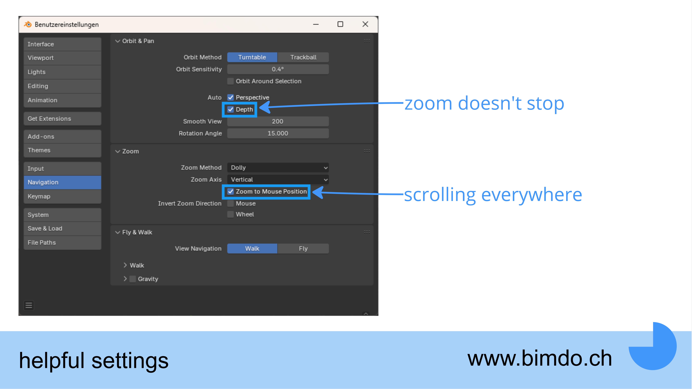
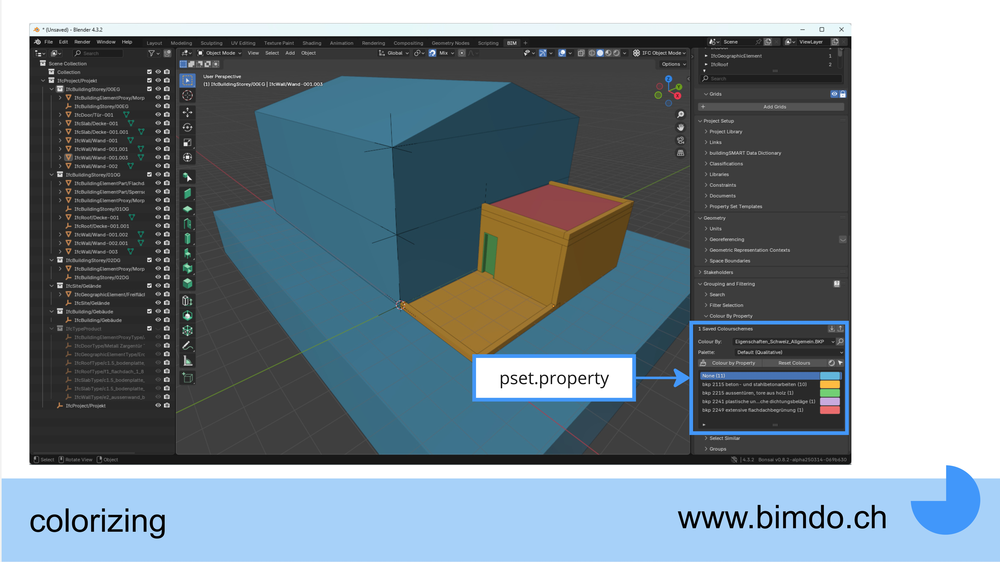

## Introduction
As part of a Bonsai interview series by [Petru Conduraru](https://www.linkedin.com/in/petruc/), the following content was created to help you get started with Bonsai. Would you like to share your knowledge too? Contact Petru directly and become part of the interview series.
You can find the related interview [here](https://www.linkedin.com/events/7306208458582757378/about/).

---
## Helpful Links
### Software
- [Download Blender](https://www.blender.org/download/)
- [Download Bonsai Add-on](https://blenderbim.org/download.html)

### Community & Support
- [Bonsai GitHub Repository](https://github.com/IfcOpenShell/IfcOpenShell)
- [IFC Architect - Bonsai Documentation](https://ifcarchitect.com/)
- [IFC Architect YouTube Channel](https://www.youtube.com/@ifcarchitect)
- [BIMvoice YouTube Channel](https://www.youtube.com/@BIMvoice)
- [Bonsai Community Forum](https://community.osarch.org/)

---
## Feature Overview
Bonsai is a powerful open-source BIM tool for Blender that offers diverse functions:

### Main features I actively use

- **BIM Viewer & Coordination**
    - Fast navigation and visualization of IFC models
    - Flexible filter options for targeted analysis of building components

- **Information Management**
    - Easy access to all IFC properties and attributes
    - Structured display of building hierarchy

- **Visualization**
    - Customizable color schemes for different properties

- **Model Modification**
    - Adjustment of properties and attributes

### Additional available features

- **Modeling**: Creation of native BIM elements
- **Cost Management**: Linking with cost data
- **Resource Planning**: Temporal and material resource management
- **Quality Control**: Automated model checks
- **Calculation**: Quantity and mass determination
- **Facility Management**: Support for building operations

---
## Navigation Settings
- **Depth**: This checkbox optimizes scrolling and prevents navigation from being blocked by objects in the foreground.
- **Zoom to Mouse Position**: This setting causes the zoom to occur directly at the mouse position, instead of zooming from the center of the screen.

---
## Navigator Filter Selected
The filter function allows selective filtering of the hierarchical tree structure - particularly useful for large IFC models. This makes the tree structure display only elements that are currently selected in the model.

---
## IFC Structure and Shift
- **shift**: A useful function is holding the Shift key while opening and closing the tree structure, which allows opening and closing the structure including all subfolders.
- **IFC Structure**: Compared to other IFC viewers, it's noticeable that the structure looks somewhat different, for example, the levels are geometrically represented. This "different" approach is likely the native and correctly displayed IFC structure.

---
## Environment Display
The following screenshot shows how visual settings such as axis colors and the work grid can be adjusted. Additionally, reference crosses for levels and other elements can be shown or hidden.

---
## Saving the Work Environment
As you might know from other tools, you can also save your settings for your work environment in Blender, such as the arrangement of different workspaces.

---
## Shortcuts
- **shift**: Shift is very powerful, allowing tree structures with substructures to be opened and closed, or all subelements in the tree structure to be shown and hidden.
- **Point**: Using the shortcut "." or depending on language settings "," optimizes zoom to selection. You select the element e.g. in the navigator and zoom directly to the element in 3D.
- **Transparency**: Admittedly this is not a shortcut, but still very helpful for coordination.
- **H**: Hide a selected element
- **alt+H**: Show everything
- **shift+H**: Hide all non-selected elements

---
## Coloring by Property
A very practical function for coloring model elements. Important to know: if your property or property set doesn't appear, select an element and try again.

### Bonsai vs. Solibri
In Bonsai, there is currently no list that also contains colors. These functions are separate, either list or color.
> This is a very practical function for performing visual checks and getting an overview of the data.

---
## Filter
The filter function is very powerful; note the differences between property and attribute.

---
## Sections in the Model
Using section cutaways is not the easiest method and is still somewhat unstable. However, it works in the version shown in the screenshot.
> A more optimal application is to select the "Fetch Tool" on the left side in the Bonsai toolbar (green box with white cursor icon). With Shift+C, a clipping plane can then be placed as desired.

---
**Published on:** {{ page.meta.date }} | **Code:** {{ page.file.name[:10] }}  | **Author:** {{ page.meta.author }}

**Tags:** {{ page.meta.tags | join(', ') }}
