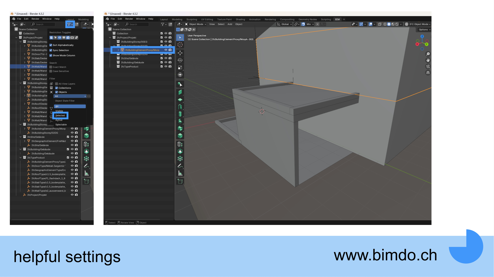
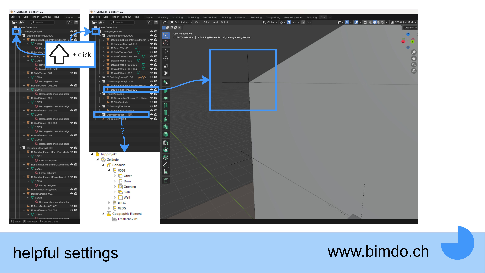
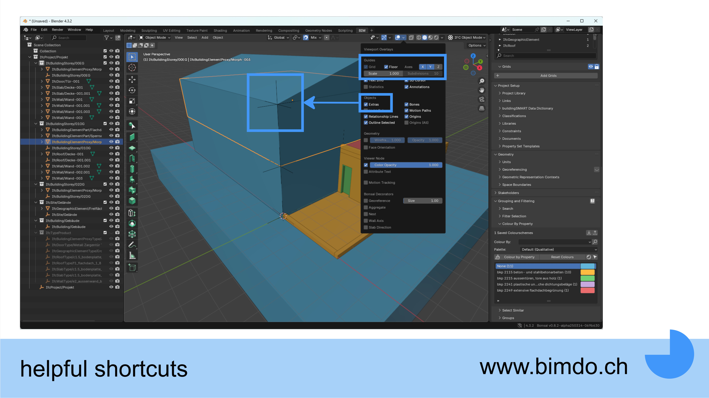
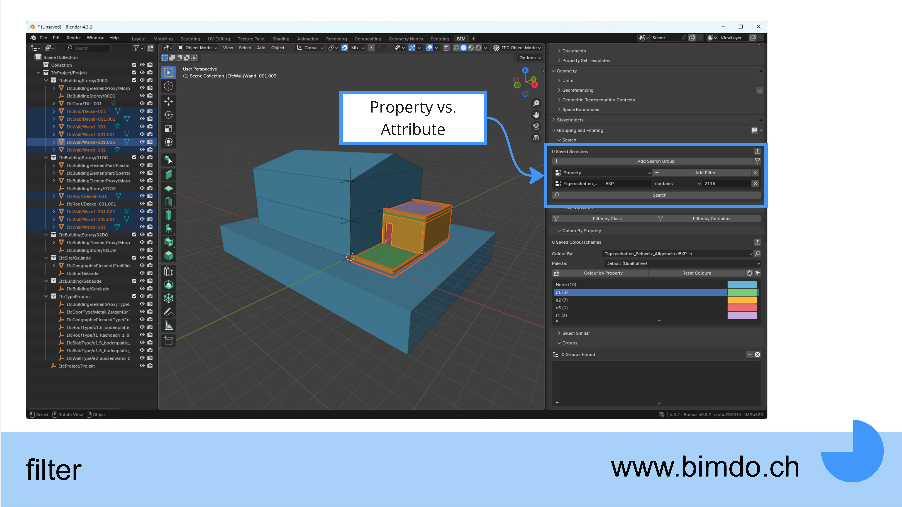

## Introduction
Dans le cadre d'une série d'interviews Bonsai par [Petru Conduraru](https://www.linkedin.com/in/petruc/), les contenus suivants ont été créés pour vous aider à démarrer avec Bonsai. Vous souhaitez également partager vos connaissances ? Contactez directement Petru et faites partie de la série d'interviews.
Vous pouvez trouver l'interview associée [ici](https://www.linkedin.com/events/7306208458582757378/about/).

---
## Liens utiles
### Logiciel
- [Télécharger Blender](https://www.blender.org/download/)
- [Télécharger l'add-on Bonsai](https://blenderbim.org/download.html)

### Communauté & Support
- [Dépôt GitHub de Bonsai](https://github.com/IfcOpenShell/IfcOpenShell)
- [IFC Architect - Documentation Bonsai](https://ifcarchitect.com/)
- [Chaîne YouTube IFC Architect](https://www.youtube.com/@ifcarchitect)
- [Chaîne YouTube BIMvoice](https://www.youtube.com/@BIMvoice)
- [Forum de la communauté Bonsai](https://community.osarch.org/)

---
## Aperçu des fonctionnalités
Bonsai est un puissant outil BIM open-source pour Blender qui offre diverses fonctions:

### Fonctionnalités principales que j'utilise activement

- **Visualisation BIM & Coordination**
    - Navigation rapide et visualisation des modèles IFC
    - Options de filtrage flexibles pour une analyse ciblée des composants du bâtiment

- **Gestion de l'information**
    - Accès facile à toutes les propriétés et attributs IFC
    - Affichage structuré de la hiérarchie du bâtiment

- **Visualisation**
    - Schémas de couleurs personnalisables pour différentes propriétés

- **Modification de modèle**
    - Ajustement des propriétés et attributs

### Fonctionnalités supplémentaires disponibles

- **Modélisation**: Création d'éléments BIM natifs
- **Gestion des coûts**: Liaison avec les données de coûts
- **Planification des ressources**: Gestion des ressources temporelles et matérielles
- **Contrôle qualité**: Vérifications automatisées du modèle
- **Calcul**: Détermination des quantités et des masses
- **Gestion des installations**: Support pour l'exploitation des bâtiments

---
## Paramètres de navigation
- **Depth**: Cette case à cocher optimise le défilement et empêche que la navigation soit bloquée par des objets au premier plan.
- **Zoom to Mouse Position**: Ce paramètre fait que le zoom s'effectue directement à la position de la souris, au lieu de zoomer depuis le centre de l'écran.

---
## Filtre de sélection du navigateur
La fonction de filtre permet un filtrage sélectif de la structure arborescente hiérarchique - particulièrement utile pour les grands modèles IFC. Cela fait que la structure arborescente n'affiche que les éléments actuellement sélectionnés dans le modèle.

---
## Structure IFC et Shift
- **shift**: Une fonction utile consiste à maintenir la touche Shift enfoncée lors de l'ouverture et de la fermeture de la structure arborescente, ce qui permet d'ouvrir et de fermer la structure, y compris tous les sous-dossiers.
- **Structure IFC**: Comparé à d'autres visualiseurs IFC, on remarque que la structure semble quelque peu différente, par exemple, les niveaux sont représentés géométriquement. Cette approche "différente" est probablement la structure IFC native et correctement affichée.

---
## Affichage de l'environnement
La capture d'écran suivante montre comment les paramètres visuels tels que les couleurs des axes et la grille de travail peuvent être ajustés. De plus, les croix de référence pour les niveaux et autres éléments peuvent être affichées ou masquées.

---
## Sauvegarde de l'environnement de travail
Comme vous le savez peut-être d'autres outils, vous pouvez également enregistrer vos paramètres pour votre environnement de travail dans Blender, comme par exemple l'agencement de différents espaces de travail.

---
## Raccourcis
- **shift**: Shift est très puissant, permettant d'ouvrir et de fermer des structures arborescentes avec des sous-structures, ou d'afficher et de masquer tous les sous-éléments dans la structure arborescente.
- **Point**: Utiliser le raccourci "." ou selon les paramètres de langue "," optimise le zoom sur la sélection. Vous sélectionnez l'élément par exemple dans le navigateur et zoomez directement sur l'élément en 3D.
- **Transparence**: Certes, ce n'est pas un raccourci, mais c'est tout de même très utile pour la coordination.
- **H**: Masquer un élément sélectionné
- **alt+H**: Tout afficher
- **shift+H**: Masquer tous les éléments non sélectionnés

---
## Coloration par propriété
Une fonction très pratique pour colorer les éléments du modèle. Important à savoir: si votre propriété ou ensemble de propriétés n'apparaît pas, sélectionnez un élément et réessayez.

### Bonsai vs. Solibri
Dans Bonsai, il n'existe actuellement pas de liste qui contient également des couleurs. Ces fonctions sont séparées, soit liste, soit couleur.
> C'est une fonction très pratique pour effectuer des vérifications visuelles et obtenir un aperçu des données.

---
## Filtre
La fonction de filtre est très puissante; notez les différences entre propriété et attribut.

---
## Sections dans le modèle
L'utilisation des coupes de section n'est pas la méthode la plus facile et est encore un peu instable. Cependant, elle fonctionne dans la version montrée dans la capture d'écran.
> Une application plus optimale consiste à sélectionner l'outil "Fetch" sur le côté gauche dans la barre d'outils Bonsai (icône de boîte verte avec curseur blanc). Avec Shift+C, un plan de coupe peut ensuite être placé comme souhaité.

---
**Publié le:** {{ page.meta.date }} | **Code:** {{ page.file.name[:10] }}  | **Auteur:** {{ page.meta.author }}

**Tags:** {{ page.meta.tags | join(', ') }} | **Original:** {{ page.meta.original }}