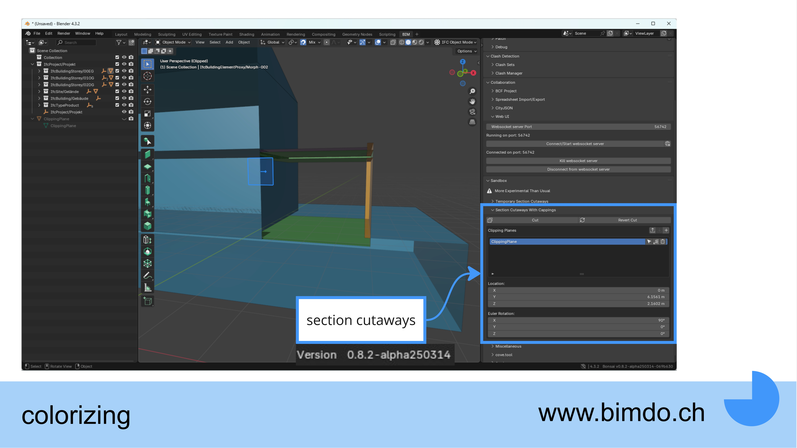

## Introduzione
Come parte di una serie di interviste su Bonsai di [Petru Conduraru](https://www.linkedin.com/in/petruc/), sono stati creati i seguenti contenuti per aiutarti a iniziare con Bonsai. Vuoi anche tu condividere le tue conoscenze? Contatta direttamente Petru e diventa parte della serie di interviste.
Puoi trovare l'intervista correlata [qui](https://www.youtube.com/watch?v=bp3uZyTVqpk).

  <iframe width="560" height="315" src="https://www.youtube-nocookie.com/embed/bp3uZyTVqpk?si=ZIHVXgTVxoe754So" frameborder="0" allowfullscreen></iframe>

---
## Link utili
### Software
- [Scaricare Blender](https://www.blender.org/download/)
- [Scaricare l'add-on Bonsai](https://blenderbim.org/download.html)

### Comunità & Supporto
- [Repository GitHub di Bonsai](https://github.com/IfcOpenShell/IfcOpenShell)
- [IFC Architect - Documentazione Bonsai](https://ifcarchitect.com/)
- [Canale YouTube IFC Architect](https://www.youtube.com/@ifcarchitect)
- [Canale YouTube BIMvoice](https://www.youtube.com/@BIMvoice)
- [Forum della comunità Bonsai](https://community.osarch.org/)

---
## Panoramica delle funzionalità
Bonsai è un potente strumento BIM open-source per Blender che offre diverse funzioni:

### Funzionalità principali che utilizzo attivamente

- **Visualizzatore BIM & Coordinamento**
    - Navigazione rapida e visualizzazione di modelli IFC
    - Opzioni di filtraggio flessibili per l'analisi mirata dei componenti edilizi

- **Gestione delle informazioni**
    - Facile accesso a tutte le proprietà e attributi IFC
    - Visualizzazione strutturata della gerarchia dell'edificio

- **Visualizzazione**
    - Schemi di colori personalizzabili per diverse proprietà

- **Modifica del modello**
    - Regolazione di proprietà e attributi

### Funzionalità aggiuntive disponibili

- **Modellazione**: Creazione di elementi BIM nativi
- **Gestione dei costi**: Collegamento con dati sui costi
- **Pianificazione delle risorse**: Gestione delle risorse temporali e materiali
- **Controllo qualità**: Verifiche automatizzate del modello
- **Calcolo**: Determinazione di quantità e masse
- **Facility Management**: Supporto per le operazioni dell'edificio

---
## Impostazioni di navigazione
- **Depth**: Questa casella di controllo ottimizza lo scorrimento e impedisce che la navigazione venga bloccata da oggetti in primo piano.
- **Zoom to Mouse Position**: Questa impostazione fa sì che lo zoom avvenga direttamente alla posizione del mouse, invece di zoomare dal centro dello schermo.

---
## Filtro di selezione del navigatore
La funzione di filtro consente di filtrare selettivamente la struttura ad albero gerarchica - particolarmente utile per grandi modelli IFC. Questo fa sì che la struttura ad albero mostri solo gli elementi attualmente selezionati nel modello.

---
## Struttura IFC e Shift
- **shift**: Una funzione utile è tenere premuto il tasto Shift durante l'apertura e la chiusura della struttura ad albero, che permette di aprire e chiudere la struttura incluse tutte le sottocartelle.
- **Struttura IFC**: Rispetto ad altri visualizzatori IFC, si nota che la struttura appare in qualche modo diversa, ad esempio, i livelli sono rappresentati geometricamente. Questo approccio "diverso" è probabilmente la struttura IFC nativa e correttamente visualizzata.

---
## Visualizzazione dell'ambiente
La seguente schermata mostra come le impostazioni visive come i colori degli assi e la griglia di lavoro possono essere regolate. Inoltre, le croci di riferimento per livelli e altri elementi possono essere mostrate o nascoste.

---
## Salvare l'ambiente di lavoro
Come potresti sapere da altri strumenti, puoi anche salvare le tue impostazioni per il tuo ambiente di lavoro in Blender, come ad esempio la disposizione di diversi spazi di lavoro.

---
## Scorciatoie
- **shift**: Shift è molto potente, permettendo di aprire e chiudere strutture ad albero con sottostrutture, o mostrare e nascondere tutti i sottoelementi nella struttura ad albero.
- **Punto**: Utilizzando la scorciatoia "." o a seconda delle impostazioni della lingua ",", si ottimizza lo zoom sulla selezione. Selezioni l'elemento ad esempio nel navigatore e zoomi direttamente sull'elemento in 3D.
- **Trasparenza**: Ammetto che questa non è una scorciatoia, ma è comunque molto utile per il coordinamento.
- **H**: Nascondere un elemento selezionato
- **alt+H**: Mostrare tutto
- **shift+H**: Nascondere tutti gli elementi non selezionati

---
## Colorazione per proprietà
Una funzione molto pratica per colorare gli elementi del modello. Importante da sapere: se la tua proprietà o set di proprietà non appare, seleziona un elemento e riprova.

### Bonsai vs. Solibri
In Bonsai, attualmente non esiste un elenco che contenga anche i colori. Queste funzioni sono separate, o elenco o colore.
> Questa è una funzione molto pratica per eseguire controlli visivi e ottenere una panoramica dei dati.

---
## Filtro
La funzione di filtro è molto potente; nota le differenze tra proprietà e attributo.

---
## Sezioni nel modello
L'utilizzo delle sezioni di taglio non è il metodo più facile ed è ancora un po' instabile. Tuttavia, funziona nella versione mostrata nella schermata.
> Un'applicazione più ottimale è selezionare lo "Strumento Fetch" sul lato sinistro nella barra degli strumenti Bonsai (icona della scatola verde con cursore bianco). Con Shift+C, un piano di ritaglio può quindi essere posizionato come desiderato.

---
**Pubblicato il:** {{ page.meta.date }} | **Codice:** {{ page.file.name[:10] }}  | **Autore:** {{ page.meta.author }}

**Tag:** {{ page.meta.tags | join(', ') }} | **Originale:** {{ page.meta.original }}